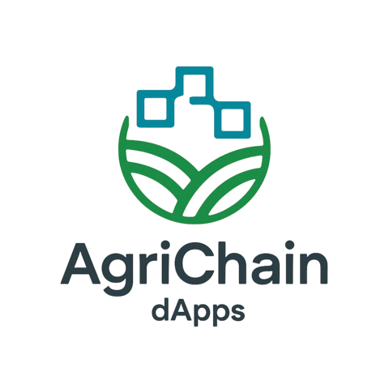

<div align="center">



# 🌾 AgriChain Finance

**Global Decentralized Agricultural Financing Platform powered by Hedera DLT**

### 🚀 [Live Demo: https://agrichains.xyz](https://agrichains.xyz)

</div>

> Connecting farmers worldwide with investors through blockchain technology. Access capital without banks, transparent, and low cost.

[](https://hedera.com)
[](https://soliditylang.org/)
[](https://nextjs.org/)
[](LICENSE)
[](https://agrichains.xyz)

### 📜 Certification

**View Certificate:** https://drive.google.com/file/d/1qwAF367SYiK83qeWX8jjWTv19UOvVAjX/view?usp=sharing

---

## 📋 Table of Contents

- [Features](#-features)
- [Architecture](#-architecture)
- [Tech Stack](#-tech-stack)
- [Quick Start](#-quick-start)
- [User Roles](#-user-roles)
- [Verification System](#-verification-system)
- [Smart Contract](#-smart-contract)
- [Global Coverage](#-global-coverage)
- [Use Cases](#-use-cases)
- [Testing](#-testing)
- [Security](#-security)
- [Roadmap](#-roadmap)
- [Contributing](#-contributing)
- [License](#-license)
- [Acknowledgments](#-acknowledgments)
- [Contact & Support](#-contact--support)

---

## ✨ Features

### Core Features

- 🌾 **Harvest NFT Creation** - Create real NFTs on Hedera blockchain (~$0.005 per NFT)
- 💰 **Decentralized Loans** - Request loans up to 70% of harvest value
- 📊 **Transparent Investment** - Investors fund loans and earn returns
- 🤖 **Smart Contract Automation** - Automatic payment and profit distribution
- ⚡ **Ultra Low Cost** - Transaction fees ~$0.0001 (Hedera)
- 🌍 **Global Platform** - Support for 50+ countries across 5 continents

### Advanced Features

- 🎨 **Real Hedera NFTs** - Harvest tokens as verifiable NFTs on Hedera
- 🔗 **HashScan Integration** - All NFTs verifiable on HashScan explorer
- 🛡️ **4-Level Verification System** - KYC verification with increasing benefits
- 📱 **Responsive Design** - Works on mobile, tablet, and desktop
- 🔄 **Real-time Updates** - Auto-refresh verification levels and loan status
- 🌐 **Multi-Region Support** - Asia, Africa, Americas, Europe, Oceania
- 📈 **Portfolio Dashboard** - Track loans and investments
- 🔐 **Blockchain Verified** - All transactions recorded on Hedera Testnet
- 💾 **Online NFT Storage** - NFT data accessible from anywhere via API
- 🔒 **Data Consistency** - Auto-fill loan forms from NFT data (read-only)

---

## 🏗️ Architecture

```
┌─────────────┐      ┌──────────────┐      ┌─────────────┐
│   Farmer    │──────│  Smart       │──────│  Investor   │
│             │      │  Contract    │      │             │
│ - Tokenize  │      │              │      │ - Browse    │
│ - Request   │      │ - Verify     │      │ - Invest    │
│ - Repay     │      │ - Escrow     │      │ - Withdraw  │
└─────────────┘      │ - Distribute │      └─────────────┘
                     └──────────────┘
                            │
                     ┌──────┴──────┐
                     │   Hedera    │
                     │  Blockchain │
                     └─────────────┘
```

### Data Flow

```
1. Farmer → Create Harvest NFT → Mint on Hedera (~$0.005)
2. Farmer → Request Loan → Use NFT or Create New Token
3. Loan → Listed in Marketplace → Visible to Investors
4. Investor → Browse Loans → Invest HBAR
5. Smart Contract → Escrow Funds → Transfer to Farmer
6. Farmer → Harvest & Sell → Repay Loan + Interest
7. Smart Contract → Calculate Profit → Distribute to Investors
8. NFT → Reusable → Can be used for future loans
```

### NFT Flow

```
Option A: Use Existing NFT
1. Farmer selects existing NFT from dropdown
2. Form auto-fills with NFT data (read-only)
3. Skip to loan details (amount, interest, duration)
4. Submit → Loan created using NFT as collateral

Option B: Create New Harvest Token
1. Farmer fills harvest details manually
2. Fill loan details
3. Submit → Harvest token + Loan created together
```

---

## 🛠️ Tech Stack

### Blockchain
- **Network**: Hedera Hashgraph (Testnet)
- **Smart Contracts**: Solidity 0.8.20
- **SDK**: Hedera JavaScript SDK
- **Standards**: ERC-20 compatible

### Frontend
- **Framework**: Next.js 14 (React 18)
- **Styling**: Tailwind CSS
- **State Management**: React Context API
- **Wallet Integration**: MetaMask, HashPack
- **HTTP Client**: Fetch API
- **Notifications**: React Hot Toast

### Backend
- **API**: Next.js API Routes
- **NFT Storage**: JSON file-based database (development)
- **NFT API**: RESTful endpoints for NFT data
- **File Storage**: Local filesystem (development)
- **Hedera SDK**: For NFT minting and transfers

### Development Tools
- **Language**: TypeScript
- **Build Tool**: Hardhat
- **Testing**: Hardhat Test
- **Linting**: ESLint
- **Formatting**: Prettier

---

## 🚀 Quick Start

### Prerequisites

- **Node.js** v18 or higher
- **npm** or **yarn**
- **Hedera Testnet Account** ([Get one here](https://portal.hedera.com))
- **Wallet**: MetaMask or HashPack
- **HBAR**: Get testnet HBAR from [Hedera Faucet](https://portal.hedera.com/faucet)

### Installation

#### 1. Clone Repository

```bash
git clone https://github.com/yourusername/agrichain-finance.git
cd agrichain-finance
```

#### 2. Install Dependencies

```bash
# Root dependencies (Hardhat, contracts)
npm install

# Frontend dependencies
cd frontend
npm install
cd ..
```

#### 3. Setup Environment Variables

```bash
# Root .env for contract deployment
cp .env.example .env

# Edit .env with your Hedera credentials
nano .env
```

**Required variables in root `.env`:**
```env
HEDERA_ACCOUNT_ID=0.0.YOUR_ACCOUNT_ID
HEDERA_PRIVATE_KEY=YOUR_PRIVATE_KEY
HEDERA_NETWORK=testnet
```

```bash
# Frontend .env.local
cd frontend
cp .env.example .env.local

# Edit .env.local
nano .env.local
```

**Required variables in `frontend/.env.local`:**
```env
NEXT_PUBLIC_CONTRACT_ADDRESS=0xYourContractAddress
NEXT_PUBLIC_HARVEST_NFT_CONTRACT=0xYourNFTContractAddress
NEXT_PUBLIC_HEDERA_NETWORK=testnet
NEXT_PUBLIC_HEDERA_RPC_URL=https://testnet.hashio.io/api
HEDERA_ACCOUNT_ID=0.0.YOUR_ACCOUNT_ID
HEDERA_PRIVATE_KEY=YOUR_PRIVATE_KEY
```

#### 4. Compile Smart Contracts

```bash
# From root directory
npm run compile
```

#### 5. Deploy Smart Contract

```bash
# Deploy to Hedera Testnet
npm run deploy:testnet

# Copy the contract address from output
# Update frontend/.env.local with the contract address
```

#### 6. Run Frontend

```bash
cd frontend
npm run dev
```

Open [http://localhost:3004](http://localhost:3004) in development

Or visit live demo: **[https://agrichains.xyz](https://agrichains.xyz)** 🎉

---

## 👥 User Roles

### 🌾 Farmer

**Capabilities:**
- **Create Harvest NFTs** - Mint real NFTs on Hedera blockchain
- **Request Loans** - Two options:
  - Use existing NFT (auto-fill, data locked)
  - Create new harvest token (manual input)
- **Repay Loans** - With interest via smart contract
- **Track Loan Status** - Real-time updates from blockchain
- **Upgrade Verification** - Increase loan limits and lower interest rates
- **View NFT Portfolio** - All NFTs accessible online

**Verification Levels:**
- **Level 1 (Basic)** 🥉 - Max $2,000, Interest 5-7%
- **Level 2 (Verified)** 🥈 - Max $5,000, Interest 4-6%
- **Level 3 (Premium)** 🥇 - Max $20,000, Interest 3-5%
- **Level 4 (Elite)** 💎 - Unlimited, Interest 2-4%

**NFT Features:**
- ✅ Verifiable on HashScan
- ✅ Reusable for multiple loans
- ✅ Platform custody model (secure)
- ✅ Cost: ~0.05 HBAR (~$0.005)

### 💼 Investor

**Capabilities:**
- Browse loan marketplace
- Filter loans by status, crop type
- Invest in loans (partial or full funding)
- Track investment portfolio
- Withdraw profits after repayment

**Benefits:**
- Diversify across multiple loans
- Transparent on-chain records
- Automatic profit distribution
- Low platform fees

### 🛡️ Admin

**Capabilities:**
- Review verification requests
- Approve/reject farmer verification
- Set verification levels on blockchain
- Monitor platform activity

---

## 🛡️ Verification System

### 4-Level KYC System

| Level | Badge | Max Loan | Interest | Requirements |
|-------|-------|----------|----------|--------------|
| **1** | 🥉 Basic | $2,000 | 5-7% | Wallet connection only |
| **2** | 🥈 Verified | $5,000 | 4-6% | ID, Land certificate, Farm photo |
| **3** | 🥇 Premium | $20,000 | 3-5% | Enhanced verification + history |
| **4** | 💎 Elite | Unlimited | 2-4% | Premium + track record |

### Verification Process

```
1. Farmer submits verification request
   ├─ Personal information
   ├─ ID document
   ├─ Land certificate
   └─ Farm photos

2. Admin reviews request
   ├─ Verify documents
   ├─ Check information
   └─ Make decision

3. Approval triggers blockchain transaction
   ├─ contract.setVerification()
   ├─ Level updated on-chain
   └─ Farmer notified

4. Farmer sees updated level
   ├─ Auto-refresh (30 seconds)
   ├─ Manual refresh button
   └─ Toast notification
```

### Features

- ✅ **Real-time Updates** - Auto-refresh every 30 seconds
- ✅ **Manual Refresh** - Button to force update
- ✅ **Toast Notifications** - Visual feedback on changes
- ✅ **Blockchain Verified** - All levels stored on-chain
- ✅ **Multi-browser Support** - Data synced across devices

---

## 📜 Smart Contract

### Contract: `AgriChainFinance.sol`

**Address (Testnet):** Check `frontend/.env.local`

### Key Functions

#### For Farmers

```solidity
// Create harvest token (legacy)
function createHarvestToken(
    address tokenAddress,
    string memory cropType,
    uint256 expectedYield,
    uint256 estimatedValue,
    uint256 harvestDate
) external returns (uint256)

// Create harvest token from existing NFT (new)
function createHarvestTokenFromNFT(
    uint256 nftInternalId
) external returns (uint256)

// Request loan
function requestLoan(
    uint256 harvestTokenId,
    uint256 requestedAmount,
    uint256 interestRate,
    uint256 duration
) external returns (uint256)

// Repay loan
function repayLoan(uint256 loanId) external payable
```

#### NFT API Endpoints

```typescript
// Get all NFTs or filter by farmer
GET /api/nfts?farmer=0xAddress

// Get single NFT by ID
GET /api/nfts/[id]

// Create NFT (mints on Hedera)
POST /api/harvest-nft/create
```

#### For Investors

```solidity
// Invest in loan
function investInLoan(uint256 loanId) external payable

// Withdraw profit
function withdrawInvestment(
    uint256 loanId,
    uint256 investmentIndex
) external
```

#### For Admin

```solidity
// Set farmer verification
function setVerification(
    address farmer,
    uint8 level,
    bytes32 documentHash
) external onlyOwner

// Get verification level
function getVerificationLevel(address farmer) 
    external view returns (uint8)
```

### Hedera EVM Quirks

**IMPORTANT:** Hedera EVM has unique behavior:

```solidity
// msg.value is in TINYBAR (10^8), not wei (10^18)
// Must convert: tinybar * 10^10 = wei

uint256 private constant TINYBAR_TO_WEI = 10**10;

function investInLoan(uint256 _loanId) external payable {
    // Convert tinybar to wei
    uint256 investmentAmountWei = msg.value * TINYBAR_TO_WEI;
    // ... rest of logic
}
```

---

## 🌍 Global Coverage

### Supported Regions (50+ Countries)

#### 🌏 Asia (10 countries)
Indonesia, India, China, Thailand, Vietnam, Philippines, Bangladesh, Pakistan, Malaysia, Myanmar

#### 🌍 Africa (10 countries)
Kenya, Nigeria, Ghana, Tanzania, Uganda, Ethiopia, South Africa, Egypt, Morocco, Senegal

#### 🌎 Americas (8 countries)
Brazil, United States, Mexico, Argentina, Colombia, Peru, Canada, Chile

#### 🌍 Europe (8 countries)
France, Germany, Spain, Italy, Poland, Romania, Ukraine, United Kingdom

#### 🌏 Oceania (3 countries)
Australia, New Zealand, Papua New Guinea

### Market Potential

- **Total Farmers Worldwide:** 570 million
- **Unbanked Farmers:** 400 million (70%)
- **Agricultural GDP:** $3.6 trillion
- **Financing Gap:** $170 billion

---

## 💡 Use Cases

### Example 1: Rice Farmer (Indonesia)

```
Farmer: Budi
Location: Makassar, Indonesia
Farm: 12 hectares
Crop: Rice

Scenario:
1. Budi tokenizes 10 tons rice harvest (value: 5,000 HBAR)
2. Requests loan: 3,500 HBAR (70% of value)
3. Interest: 5% (Level 2 verified)
4. Duration: 90 days
5. Investors fund the loan
6. Budi receives 3,500 HBAR
7. After harvest, repays 3,675 HBAR (3,500 + 175 interest)
8. Investors receive profit proportionally
```

### Example 2: Coffee Farmer (Kenya)

```
Farmer: Jumardi
Location: Nairobi, Kenya
Farm: 5 hectares
Crop: Coffee

Scenario:
1. Jumardi tokenizes 500kg coffee (value: 2,000 HBAR)
2. Requests loan: 1,400 HBAR (70%)
3. Interest: 6% (Level 1 basic)
4. Duration: 120 days
5. Multiple investors fund
6. Jumardi buys fertilizer and equipment
7. After harvest, repays 1,484 HBAR
8. Investors earn 6% return
```

### Example 3: Soybean Farmer (Brazil)

```
Farmer: Carlos
Location: São Paulo, Brazil
Farm: 50 hectares
Crop: Soybeans

Scenario:
1. Carlos tokenizes 100 tons soybeans (value: 20,000 HBAR)
2. Requests loan: 14,000 HBAR (70%)
3. Interest: 4% (Level 3 premium)
4. Duration: 150 days
5. Large investors fund
6. Carlos expands production
7. Repays 14,560 HBAR
8. Investors earn 4% return
```

---

---

## 🎨 Harvest NFTs

### What are Harvest NFTs?

Harvest NFTs are **real NFTs minted on Hedera blockchain** that represent future harvest as collateral. Each NFT contains:

- **Crop Type** (e.g., Wheat, Rice, Corn)
- **Expected Yield** (in kg)
- **Estimated Value** (in HBAR)
- **Harvest Date**
- **Farm Location**
- **Farm Size** (in hectares)

### NFT Features

✅ **Verifiable** - Check on [HashScan](https://hashscan.io/testnet)  
✅ **Reusable** - Use same NFT for multiple loans  
✅ **Transferable** - Can transfer ownership (future feature)  
✅ **Low Cost** - Only ~0.05 HBAR (~$0.005) to create  
✅ **Permanent** - Stored on Hedera blockchain forever  

### How to Create NFT

1. Go to **"Request Loan"** tab
2. Uncheck "Use Existing Harvest NFT"
3. Fill harvest details:
   - Select crop type (80+ options)
   - Enter expected yield
   - Enter estimated value
   - Set harvest date
   - Add farm location
   - Add farm size
4. Continue to loan details
5. Submit → NFT + Loan created

### How to Use Existing NFT

1. Go to **"Request Loan"** tab
2. Check **"Use Existing Harvest NFT"**
3. Select NFT from dropdown
4. Form auto-fills (fields locked)
5. Fill loan details only
6. Submit → Loan created using NFT

### NFT Custody Model

NFTs are held by the platform (treasury account) and linked to your wallet address. This ensures:

- ✅ No need to associate tokens in your wallet
- ✅ Seamless integration with loans
- ✅ Secure custody by platform
- ✅ Full rights to use as collateral

### Verify Your NFT

All NFTs can be verified on HashScan:

```
https://hashscan.io/testnet/token/{TOKEN_ID}
```

Look for:
- Token ID (e.g., 0.0.7171177)
- Serial Number (e.g., #1)
- Metadata (crop type, timestamp)
- Owner (treasury account)

---

## 🧪 Testing

### Run Tests

```bash
# Smart contract tests
npm test

# Frontend tests (if available)
cd frontend
npm test
```

### Test on Testnet

1. **Get Testnet HBAR**
   - Visit [Hedera Faucet](https://portal.hedera.com/faucet)
   - Request testnet HBAR

2. **Deploy Contract**
   ```bash
   npm run deploy:testnet
   ```

3. **Test Farmer Flow**
   - Connect wallet
   - Create harvest token
   - Request loan
   - Check marketplace

4. **Test Investor Flow**
   - Browse marketplace
   - Invest in loan
   - Check portfolio

5. **Test Admin Flow**
   - Review verification
   - Approve farmer
   - Check blockchain

### Verify on HashScan

All transactions can be verified on:
```
https://hashscan.io/testnet
```

### Test NFT Creation

1. **Create NFT**
   ```bash
   # Connect wallet
   # Go to "Request Loan" tab
   # Fill harvest details
   # Submit
   ```

2. **Verify on HashScan**
   ```
   https://hashscan.io/testnet/token/{TOKEN_ID}
   ```

3. **Use NFT for Loan**
   ```bash
   # Check "Use Existing NFT"
   # Select from dropdown
   # Form auto-fills
   # Submit loan
   ```

---

## 🐛 Troubleshooting

### Issue: Changes Not Showing in Browser

**Solution:**
```bash
# Hard refresh
Ctrl + Shift + R (Windows/Linux)
Cmd + Shift + R (Mac)

# Or clear cache
cd frontend
rm -rf .next
npm run dev
```

### Issue: NFT Not Auto-Filling Form

**Solution:**
1. Hard refresh browser (Ctrl + Shift + R)
2. Check console for errors (F12)
3. Verify NFT has `internalId` field
4. Try clearing cache and restarting dev server

### Issue: Transaction Failing

**Solution:**
1. Check you have enough HBAR for gas
2. Verify contract address in `.env.local`
3. Check network is set to "testnet"
4. View transaction on HashScan for details

### Issue: Verification Not Updating

**Solution:**
1. Wait 30 seconds for auto-refresh
2. Click manual refresh button
3. Check admin approved on blockchain
4. Hard refresh browser

### Common Errors

| Error | Cause | Solution |
|-------|-------|----------|
| `INVALID_SIGNATURE` | Wrong private key format | Use ECDSA format (302e...) |
| `METADATA_TOO_LONG` | NFT metadata > 100 bytes | Use compact format (done automatically) |
| `missing revert data` | Contract call failed | Check contract address and network |
| `insufficient funds` | Not enough HBAR | Get more from faucet |

### Get Help

- 📖 Check `HEDERA_NFT_TROUBLESHOOTING.md`
- 📖 Check `DEBUG_NFT_AUTO_FILL.md`
- 📖 Check `CACHING_SOLUTION.md`
- 💬 Open GitHub issue

---

## 🔐 Security

### Smart Contract Security

- ✅ **ReentrancyGuard** - Prevents reentrancy attacks
- ✅ **Ownable** - Access control for admin functions
- ✅ **Input Validation** - All inputs validated
- ✅ **Safe Math** - Solidity 0.8+ built-in overflow protection

### Frontend Security

- ✅ **Wallet Verification** - Address validation
- ✅ **Network Check** - Ensures Hedera Testnet
- ✅ **Input Sanitization** - Prevents XSS
- ✅ **HTTPS Only** - Secure connections (production)

### Best Practices

- 🔒 Never share private keys
- 🔒 Use hardware wallets for large amounts
- 🔒 Verify contract addresses
- 🔒 Check transactions on HashScan
- 🔒 Keep software updated

---

## 🚧 Roadmap

### Phase 1: MVP (Current) ✅
- [x] Smart contract deployment
- [x] Basic frontend
- [x] Farmer verification system
- [x] Loan marketplace
- [x] Investment functionality
- [x] **Harvest NFT creation** (Real Hedera NFTs)
- [x] **NFT-based loans** (Use NFT as collateral)
- [x] **Online NFT storage** (API endpoints)
- [x] **HashScan integration** (NFT verification)
- [x] **Unified loan flow** (Simplified UX)

### Phase 2: Enhancement (Q1 2026)
- [ ] Mobile app (React Native)
- [ ] Multi-language support
- [ ] Advanced analytics
- [ ] Insurance integration
- [ ] Weather data integration

### Phase 3: Scale (Q2 2026)
- [ ] Mainnet deployment
- [ ] Partnership with NGOs
- [ ] Regional expansion
- [ ] Fiat on/off ramps
- [ ] Credit scoring system

### Phase 4: Ecosystem (Q3 2026)
- [ ] Marketplace for harvest
- [ ] Supply chain tracking
- [ ] Carbon credit integration
- [ ] DAO governance
- [ ] Token launch

---

## 🤝 Contributing

We welcome contributions! Please follow these steps:

1. **Fork the repository**
2. **Create a feature branch**
   ```bash
   git checkout -b feature/amazing-feature
   ```
3. **Commit your changes**
   ```bash
   git commit -m 'Add amazing feature'
   ```
4. **Push to the branch**
   ```bash
   git push origin feature/amazing-feature
   ```
5. **Open a Pull Request**

### Contribution Guidelines

- Follow existing code style
- Write clear commit messages
- Add tests for new features
- Update documentation
- Be respectful and collaborative

---

## 📄 License

This project is licensed under the MIT License - see the [LICENSE](LICENSE) file for details.

---

## 🙏 Acknowledgments

- **Hedera Hashgraph** - For the amazing blockchain platform
- **OpenZeppelin** - For secure smart contract libraries
- **Next.js Team** - For the excellent React framework
- **Community** - For feedback and support

---

## 📧 Contact & Support

### Get Help

- 🌐 **Live Demo**: [https://agrichains.xyz](https://agrichains.xyz)
- �  **Documentation**: Check docs folder
- � ***GitHub Issues**: [Report bugs](https://github.com/mdlog/agrichain/issues)
- � **Ematil**: hello@agrichains.xyz
- 🐦 **Twitter**: [@AgriChainFinance](https://twitter.com/agrichainfinance)

### Community

- 💬 **Discord**: [Join our community](https://discord.gg/agrichain)
- 📱 **Telegram**: [AgriChain Group](https://t.me/agrichain)

---

<div align="center">

**Made with ❤️ for farmers worldwide**

**Powered by Hedera Hashgraph 🌐**

[Live Demo](https://agrichains.xyz) • [GitHub](https://github.com/mdlog/agrichain) • [Documentation](https://agrichains.xyz/docs)

</div>
